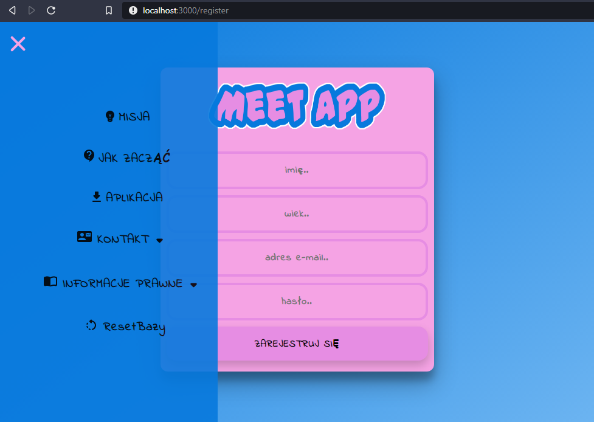

# Meet App
Front-end part of the Meet App project.

Tech stack:
* React
* JavaScript
* JSX
* HTML5
* CSS3
* Redux
* JSON Web Tokens

[Here you can find the Back-end part](https://github.com/piotrstepak/meet-app-back)

Meet App is build on the MERN stack and its principle of operation is similar to the popular Tinder app, it means 
it is an application that allows you to meet new people.

### Important
The project is under development and work on it is temporary suspended, 
it is not yet deployed and it currently works on localhost, due to the privacy of the MongoDB 
access key it is not possible to use the application locally after cloning repository(only starting page).

### To see starting page, in the project directory, you can run:
### `npm start`
Open [http://localhost:3000](http://localhost:3000) to view it in the browser.

You should see:

## Progress summary
Implemented features:
* register new user

* login

* depending on the screen size two different navigation bars(you can see above)
* update user
    * scroll inside window
    

* browse users
    * like/dislike user
    * check user description
    * browse user photo gallery
    * person in the picture added to get a good mood :)
    

* browse logged user matches
    * see the profile of the matched person
    

* when there are no people to display

* data base restart option is added to facilitate development

App fundamentals:
* the app is based on functional components with Hooks
* the state of the app is stored using Redux
* logging in takes place using a JSON Web Token that is saved in local storage
* Styles with styled-components
* Http requests with Axios
* Image gallery with react-image-gallery

 ## Future plans
 * add messaging 
 * add external image/video storage
    * add options for adding image/video
 * add analytics panel(stats, charts, e.t.c)
 * add more small features like:
    * secure all private endpoints via JWT
    * add basic information like mission, regulations e.t.c
 * add admin panel
 * make it fully responsive
 * deploy app
